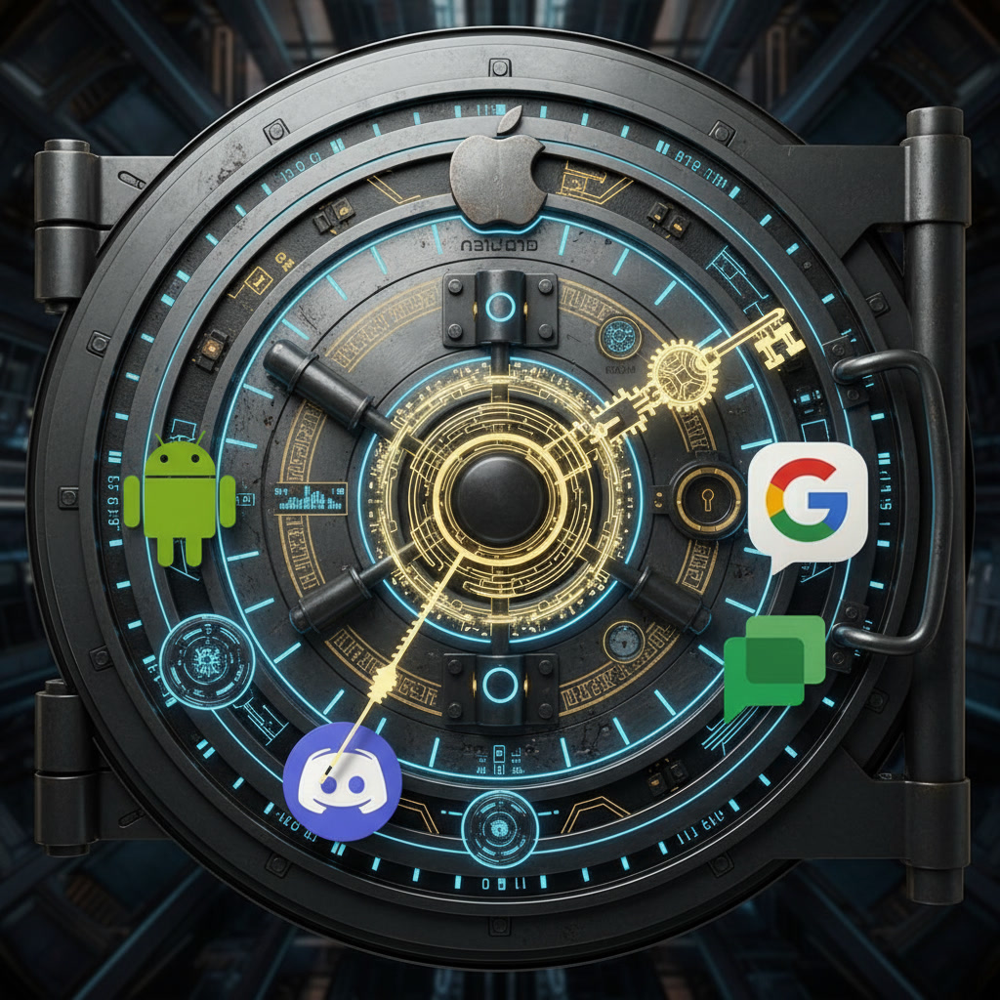




<!-- Template inspired by the Best-README-Template
     https://github.com/blackwell-systems/oss-kit/blob/main/templates/README.template.md
-->

<!-- PROJECT SHIELDS -->
<!--
*** Reference links are enclosed in brackets [ ] instead of parentheses ( ).
*** See the bottom of this document for the declaration of the reference variables
*** for contributors-url, forks-url, etc. This is an optional, concise syntax you may use.
*** https://www.markdownguide.org/basic-syntax/#reference-style-links
-->

<!-- 
[![Contributors][contributors-shield]][contributors-url]
[![Forks][forks-shield]][forks-url]
[![Stargazers][stars-shield]][stars-url]
-->
[![Issues][issues-shield]][issues-url]
[![project_license][license-shield]][license-url]

<!-- PROJECT LOGO -->
 

  

<h1 align="center">Message Vault</h1>
  

    Pry digitial conversations out of apps and store them in your own self-hosted vault.
     
     
    <a href="https://vault.bitrealm.dev/user/"><strong>Explore the docs »</strong></a>
     
    <a href="https://github.com/bitrealm-dev/message-vault">View Demo</a>
    &middot;
    <a href="https://github.com/bitrealm-dev/message-vault/issues/new?labels=bug&template=bug_report.md">Report Bug</a>
    &middot;
    <a href="https://github.com/bitrealm-dev/message-vault/issues/new?labels=enhancement&template=feature_request.md">Request Feature</a>
  

<!-- TABLE OF CONTENTS -->

  
Table of Contents

  <ol>
    <li><a href="#about-the-project">About The Project</a></li>
    <li><a href="#who-the-project-is-for">Who The Project Is For</a></li>
    <li><a href="#getting-started">Getting Started</a></li>
    <li><a href="#contributing">Contributing</a></li>
    <li><a href="#additional-documentation">Additional documentation</a></li>
    <li><a href="#license">License</a></li>
    <li><a href="#project-status">Project Status</a></li>
    <li><a href="#maintainers">Maintainers</a></li>
    <li><a href="#related-projects">Related Projects</a></li>
  </ol>

## About The Project

<!-- 

  

 -->

[![Docker][Docker]][Docker-url] [![React][React.js]][React-url] [![Rust][Rust-dev]][Rust-url] [![SQLite][SQLite]][SQLite-url] [![Tauri][Tauri]][Tauri-url] [![Vite][Vite]][Vite-url]

You own your phone. You installed the apps. You wrote the messages. So why don't you own them?

Digital messages are locked in proprietary formats, trapped inside closed platforms, inaccessible once you leave. Email solved this decades ago with open standards that let you download, search, and migrate freely. Messaging apps never did. Every platform is a silo, and your conversations are held hostage.

This project changes that. It aggregates the messages you wrote, on a platform you control, by rules you set.

### Project Details

The Message Vault software has three parts:

- **Backend** - The core system that runs on your computer. It keeps you signed in, stores your messages, and powers the search feature.
- **Desktop App** - A program that imports your messages into the vault from phone backups and app exports. You can also view, organize, and export your messages from here.
- **Webpage** - A read only version of the desktop app running in a web browser.

You can bring in:

- Apple Messages from an iPhone backup, or from Messages on a Mac
- Android texts and picture messages from an SMS Backup & Restore file
- WhatsApp from an iPhone backup or from WhatsApp’s Android files

A few older export files can still be brought in if that is all you have left.

Once messages are in the vault you can:

- Read threads the way you would in an app or on a phone, including group chats. Photos, videos, and other attachments are included.
- Search across years of conversations
- Save a copy back out as ordinary files if you want a folder on disk
- Combine texts from more than one phone or app into one archive

## Who The Project Is For

This project is for people who want a personal copy of their phone messages. That includes anyone replacing a phone, leaving a chat app, or keeping a long-term archive of texts.

## Getting Started

Follow the [User Guide](https://vault.bitrealm.dev/user/get-started/what-is-message-vault/) to run the demo and import your own data.

See the [Developer Guide](https://vault.bitrealm.dev/developer/) to setup a local development environment and and compile and run from source.

## Contributing

Contributions are **greatly appreciated** and make the open source community the great place that it is.

See [CONTRIBUTING.md](CONTRIBUTING.md) if you'd like to contribute.

## Additional documentation

The overwhelming majority of documentation is generated by [astro starlight](https://starlight.astro.build) and published to [bitrealm.dev](https://bitrealm.dev).

- [User Guide](https://vault.bitrealm.dev/user/)
- [Developer Guide](https://vault.bitrealm.dev/developer/)
- [docs/maintainers](docs/maintainers) - Not yet ported documentation.

<!-- ## How to get help

{Include links and brief descriptions for support resources. Examples provided in README template guide.}

- Reference link 1
- Reference link 2
- Reference link 3... -->

## License

Distributed under the Fair Core License. See [LICENSE.md](LICENSE.md) for more information.

## Project Status

This project is currently under heavy development and moving towards a v1.0.0 release.

## Maintainers

Matt Beisser - [message.vault@bitrealm.dev](message.vault@bitrealm.dev)

## Related Projects

- [ChatLab](https://github.com/ChatLab/ChatLab) - Local-first tool that analyzes chat history with AI.
- [Discord Export](https://discordexport.com/discord-user-list) - Hosted helpers for pulling Discord data, including a server member list.
- [DiscordChatExporter](https://github.com/tyrrrz/discordchatexporter) - Exports Discord channel history to HTML, JSON, CSV, and other files.
- [iMazing](https://imazing.com/) - Manages iOS devices and can export message threads from an iPhone or iTunes backup.
- [imessage-exporter](https://github.com/ReagentX/imessage-exporter) - Command-line tool that exports Apple Messages from `chat.db` to several text formats.
- [msgvault](https://github.com/kenn-io/msgvault) - Offline archive for email and chat with search and analytics on SQLite and DuckDB.
- [OMA WAP Forum](https://www.openmobilealliance.org/specifications/affiliates/wap-forum) - Specifications for WAP and MMS that some Android SMS apps still encode.
- [OpenExtract](https://www.openextract.app/) - Pulls iMessage, SMS, photos, and voicemail out of a local iPhone backup.
- [SMS Backup & Restore](https://www.synctech.com.au/sms-backup-restore) - Android app from SyncTech that writes SMS and MMS to an XML file.
- [SMS Backup+](https://github.com/jberkel/sms-backup-plus) - Android app that backs SMS and MMS up to an IMAP mailbox (often Gmail).

(<a href="#readme-top">back to top</a>)

<!-- MARKDOWN LINKS & IMAGES -->
<!-- https://www.markdownguide.org/basic-syntax/#reference-style-links -->
<!-- [contributors-shield]: https://img.shields.io/github/contributors/bitrealm-dev/message-vault.svg?style=for-the-badge
[contributors-url]: https://github.com/bitrealm-dev/message-vault/graphs/contributors -->
<!-- [forks-shield]: https://img.shields.io/github/forks/bitrealm-dev/message-vault.svg?style=for-the-badge
[forks-url]: https://github.com/bitrealm-dev/message-vault/network/members
[stars-shield]: https://img.shields.io/github/stars/bitrealm-dev/message-vault.svg?style=for-the-badge
[stars-url]: https://github.com/bitrealm-dev/message-vault/stargazers -->
[issues-shield]: https://img.shields.io/github/issues/bitrealm-dev/message-vault.svg?style=for-the-badge
[issues-url]: https://github.com/bitrealm-dev/message-vault/issues
[license-shield]: https://img.shields.io/badge/license-FCL_1.0-blue
[license-url]: https://github.com/bitrealm-dev/message-vault/blob/main/LICENSE.md

<!-- Shields.io badges. You can a comprehensive list with many more badges at: https://github.com/inttter/md-badges -->

[React.js]: https://img.shields.io/badge/React-%2320232a.svg?logo=react&logoColor=%2361DAFB
[React-url]: https://reactjs.org/

[Rust-dev]: https://img.shields.io/badge/Rust-%23000000.svg?e&logo=rust&logoColor=white
[Rust-url]: https://rust-lang.org/

[Tauri]: https://img.shields.io/badge/Tauri-24C8D8?logo=tauri&logoColor=fff
[Tauri-url]: https://github.com/tauri-apps/tauri

[Vite]: https://img.shields.io/badge/Vite-646CFF?logo=vite&logoColor=fff
[Vite-url]: https://vite.dev/

[SQLite]: https://img.shields.io/badge/SQLite-%2307405e.svg?logo=sqlite&logoColor=white
[SQLite-url]: https://sqlite.org/

[Docker]: https://img.shields.io/badge/Docker-2496ED?logo=docker&logoColor=fff
[Docker-url]: https://www.docker.com/

> Like this `README.md`? Explore other templates from [The Good Docs Project](https://thegooddocsproject.dev).
