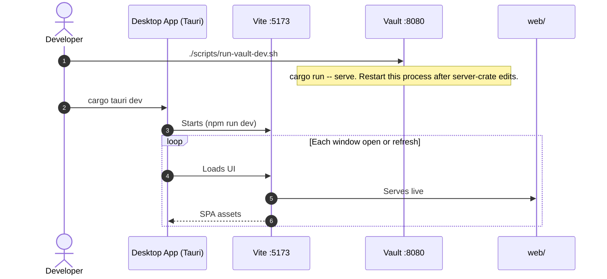
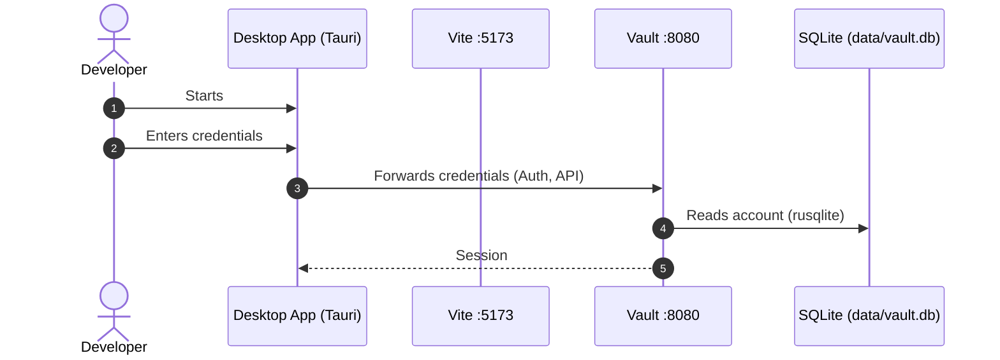
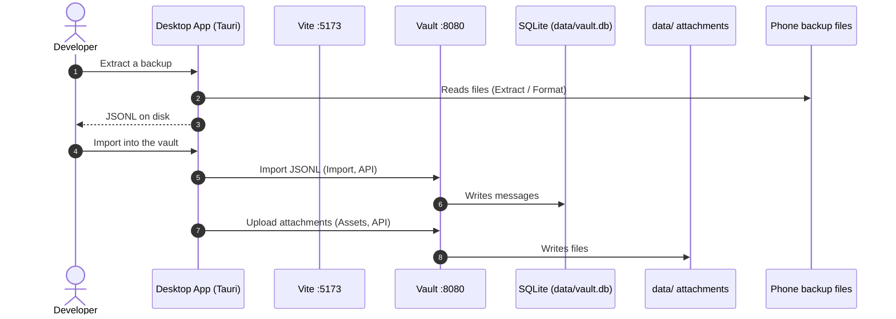
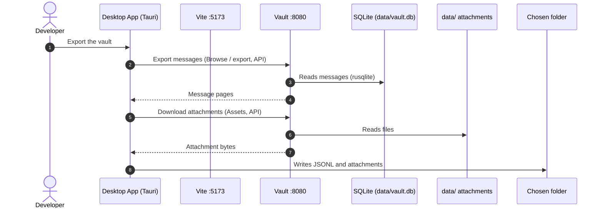

# Sequence Diagram - Developer workflow

The host processes are regular participants:

- **Desktop App (Tauri)** — native window started by `cargo tauri dev`
- **Vite :5173** — dev server that serves live `web/` source
- **Vault :8080** — `message-vault-server` started by `./scripts/run-vault-dev.sh`

## Start the vault

1. Run the vault with: `./scripts/run-vault-dev.sh`

## Sign in

**Prerequisite**

1. Vault is running on `:8080`.
2. Desktop App is running. (Vite is serving the WebView on `:5173`.)

The developer types credentials in the SPA. Login is an Auth API call to the vault, not a sign-in to Tauri.

## Import a backup

**Prerequisite**

1. Vault is running on `:8080`
2. Desktop App is running. (Vite is serving webview on `:5173`.)
3. User is signed in.

Messages and attachments are uploaded to the vault using `vault_push`.

## Export from the vault

**Prerequisite**

1. Vault is running on `:8080`
2. Desktop App is running. (Vite is serving webview on `:5173`.)
3. User is signed in.

Messages and attachments are downloaded from the vault using `vault_pull`.

