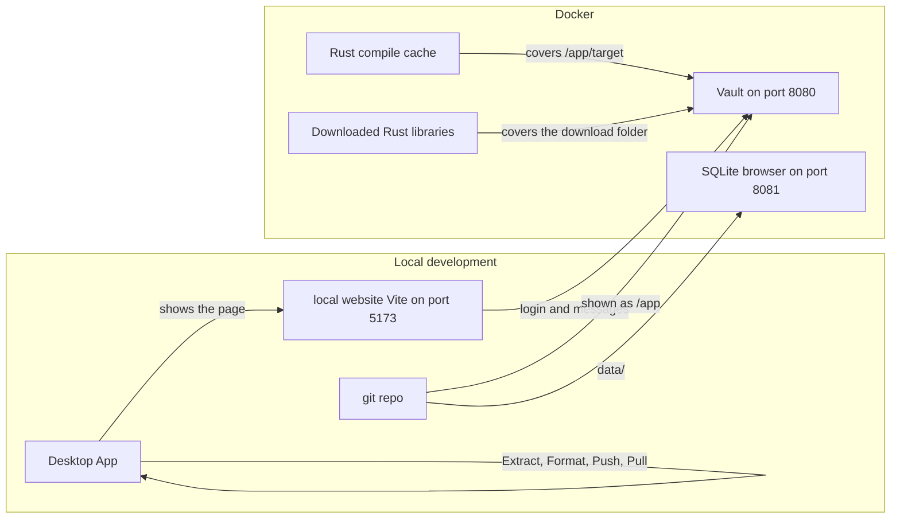
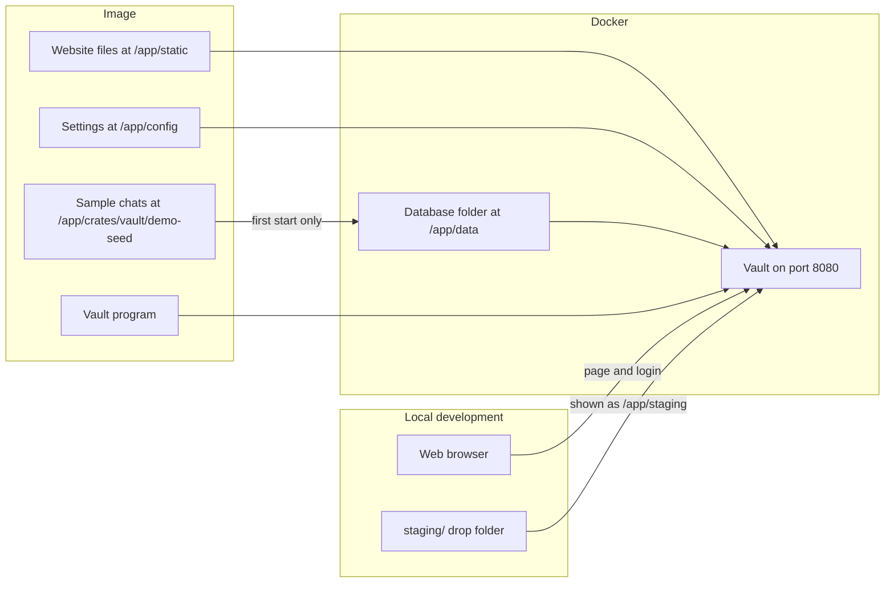

Use these Compose files when working on the vault from this repository. To try the published image without cloning, save [`docker/compose.yml`](https://github.com/bitrealm-dev/message-vault/blob/main/docker/compose.yml) as described on [Try the vault](/get-started/try-the-vault/). That sample pulls `bitrealm/message-vault`; it is not used from a clone.

## Prerequisites

- [Docker Desktop](https://www.docker.com/products/docker-desktop/) on Windows or macOS
- [Docker Engine](https://docs.docker.com/engine/install/) on Linux with the Compose v2 plugin

## Profiles

Run these from the **repository root**.

| File | Command | Best for |
|---|---|---|
| `docker/compose.dev.yml` (default) | `docker compose up` | Local development; git repo in the vault container; restart for backend edits |
| `docker/compose.release.yml` | `docker compose -f docker/compose.release.yml up --build` | Slimmer runtime image from the checkout |

A committed `.env` sets `COMPOSE_FILE=docker/compose.dev.yml`, so bare `docker compose up` uses the dev profile. Override with `-f` or change the variable in `.env`.

Three Compose files start the vault. A Compose file is a list of containers Docker should run.

| File | Command | What it is for |
|---|---|---|
| `docker/compose.dev.yml` | `docker compose up` | Day-to-day work from the git repo |
| `docker/compose.release.yml` | `docker compose -f docker/compose.release.yml up --build` | Build an install-like image from the git repo |
| `docker/compose.yml` | `docker compose -f docker/compose.yml up -d` | Pull the published image. No git clone needed |

`docker/compose.yml` and `docker/compose.release.yml` look the same once they are running. The only difference is where the image comes from. `compose.yml` pulls `bitrealm/message-vault`. `compose.release.yml` builds that kind of image from the git repo.

Do not run two of these files at once. They share port 8080.

### Dev (`docker/compose.dev.yml`)

The website does not run inside Docker.

**local website Vite** is a small server on port 5173. Vite is the tool that serves the files under `web/` and refreshes the page when those files change. `cargo tauri dev` starts it.

**Desktop App** is the window started by `cargo tauri dev`. That window loads `http://localhost:5173`. Extract, Format, Push, and Pull run in this process on the local machine.

**git repo** is the `message-vault` checkout. Docker shows that folder inside the vault container at `/app`. Rust can compile those files. A new image is not required after a backend edit. Restart the container so the compile runs again.

The vault container answers login and messages on port 8080. A SQLite browser (a web page that shows the database) listens on port 8081.



`/app/target` and the Rust library download folder are Docker-only caches. They stay out of the git repo `target/` folder. They last after the container is recreated.

### The other two files (`docker/compose.yml` and `docker/compose.release.yml`)

The website is already inside the image. Open a web browser at `http://localhost:8080`. That one port serves the page and login.

The image holds:

- the vault program
- the finished website files at `/app/static`
- settings at `/app/config`
- sample chats at `/app/crates/vault/demo-seed` (used on first start when `DEMO_DATA=true`)

The database lives in a Docker folder at `/app/data`. Import files go in `staging/` on the local machine. Docker shows that folder at `/app/staging`.

There is no Desktop App, no local website Vite, and no SQLite browser. A code change needs a new image.



## Quick start

```bash
git clone https://github.com/bitrealm-dev/message-vault.git
cd message-vault
docker compose up
```

Docker shows the git repo inside the vault container at `/app`. Restart the container after a backend edit so Rust compiles again. Serves the vault on port **8080**. Includes a SQLite browser on port **8081** (localhost only).

## Published image

The image `bitrealm/message-vault:latest` is the User Guide path. Sample data seeds on first boot when `DEMO_DATA=true` and the volume is empty. Creating a second account on that instance is [Use your own messages](/get-started/your-own-messages/). Changing `DEMO_DATA` on an existing volume does not add or remove accounts.

## Related

- [Run from source](/developer/run-from-source/)
- [HTTP API](/reference/api/)
- [Config and accounts](/reference/config-and-accounts/)
