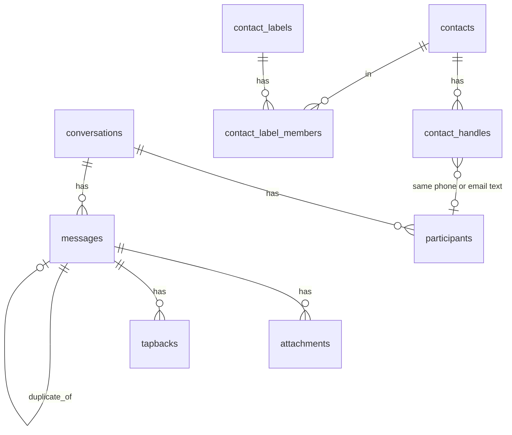
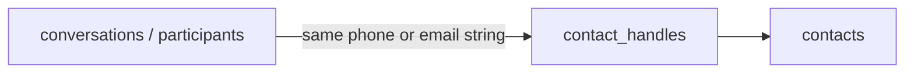

The Message Vault SQLite database falls into four groups:

1. **Chats and texts** — threads, participants, messages, files, reactions
2. **People and groups** — address book, labels, accounts
3. **Staging** — temporary copies used while importing
4. **Trash markers** — soft-delete lists without removing chat data

Chats and people are **not** joined by a shared person ID. They meet when the
**same phone number or email text** appears in both places.

## Chats and texts

### `conversations`

One row = one chat thread (`account_id`, `chat_identifier`, `service`,
`conversation_type`, `group_title`, and related fields).

### `participants`

One row = one phone or email in one chat (`handle`, optional `name_hint`).

### `messages`

One row = one message (`source`, `guid`, timestamps, `is_from_me`, `body`,
`content_key`, optional `duplicate_of`).

### `attachments` / `tapbacks`

Files and reactions tied to a message. Attachments may store `sha256` and
derived (converted) paths for the browser.

## People and accounts

### `accounts` / `account_emails` / `account_phones` / `account_api_tokens`

Web login accounts with identity fields (`first_name`, `last_name`,
`preferred_name`), phones for recognizing “you” in messages, login emails, and
hashed Vault Import API tokens used by `serve`.

### `contacts` / `contact_handles`

Address book rows and phone/email handles. Legacy `exclude` is migrated into
ordinary **Active** / **Inactive** labels; the column is kept cleared for
compatibility.

### `contact_labels` / `contact_label_members`

Named labels and membership.

## How chats meet people

There is no `contact_id` on conversations. The link is handle text:

- 1:1 `chat_identifier` and `participants.handle`
- `contact_handles.handle` on the address-book side

If the strings match, the UI treats that chat as belonging to that contact.

## Staging and trash

Import writes into `staging_*` tables first, then promotes into lasting tables
(cleared per account during import).

`trashed_handles`, `trashed_conversations`, and `trashed_contacts` mark items
as trashed without deleting underlying rows.

## Quick map

| You want… | Look in… |
|-----------|----------|
| A chat thread | `conversations` |
| Who is listed in a chat | `participants` |
| The texts | `messages` |
| Photos and files | `attachments` |
| Reactions | `tapbacks` |
| A person you named | `contacts` |
| Web login | `accounts` |
| Soft-deleted items | `trashed_*` |
| Import scratch space | `staging_*` |

Table definitions in code:
[`src/schema.rs`](https://github.com/bitrealm-dev/message-vault-rs/blob/main/src/schema.rs).

Related: [import modes and dedupe](/import/modes-and-dedupe/).
