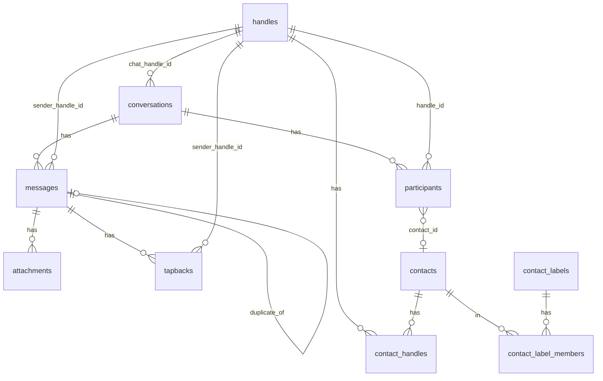
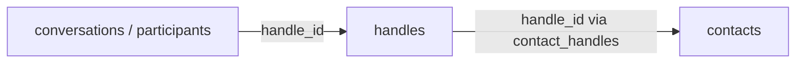

The Message Vault SQLite database falls into four groups:

1. **Chats and texts** — threads, participants, messages, files, reactions
2. **People and groups** — handles, address book, labels, accounts
3. **Staging** — temporary copies used while importing
4. **Trash markers** — soft-delete lists without removing chat data

Chats and people are **not** joined by a shared person ID. They meet through
the **`handles`** table: every phone number, email, or username appears once
per account as a typed handle, and conversations, participants, messages, and
contacts all point at the same handle rows.

## Chats and texts

### `conversations`

One row = one chat thread (`account_id`, `chat_handle_id` → `handles`,
`service`, `conversation_type`, `group_title`, and related fields).

### `participants`

One row = one handle in one chat (`handle_id` → `handles`, optional
`contact_id` → `contacts`, optional `name_hint`).

### `messages`

One row = one message (`source`, `guid`, timestamps, `is_from_me`, `body`,
`content_key`, optional `sender_handle_id` → `handles`, optional
`duplicate_of`).

### `attachments` / `tapbacks`

Files and reactions tied to a message. Attachments may store `sha256` and
derived (converted) paths for the browser. Reactions record `sender_handle_id`
→ `handles`.

## People and accounts

### `accounts` / `account_emails` / `account_handles` / `account_api_tokens`

Web accounts sign in with **user ID** (`username`) and optional password.
`preferred_name` is the display name. `account_handles` (and optional
`account_emails`) are handles used to recognize “you” in messages — emails are
never used for login. Import API tokens live in `account_api_tokens`.

### `handles`

One row = one identity per account: `raw` (as the source wrote it),
`normalized`, `handle_type` (`phone` / `email` / `username` / `other`), and an
optional `service`. Handles are deduplicated per account by
`(account_id, normalized, handle_type)`, so one phone number is a single row
whether it appeared in a chat, a contact, or the account profile. Everywhere
else in the schema, identities are referenced by `handle_id` — never by text.

### `contacts` / `contact_handles`

Address book rows; display name is `preferred_name` only. `contact_handles`
links a contact to its `handles` rows per account (one contact per handle per
account); the optional `name_hint` is the name the source gave for that handle.

### `contact_labels` / `contact_label_members`

Named labels and membership. Labels are ordinary memberships with no reserved
status names.

## How chats meet people

There is no `contact_id` on conversations. The link is the `handles` table:

- 1:1 `conversations.chat_handle_id` and `participants.handle_id` on the chat
  side
- `contact_handles.handle_id` on the address-book side
- `participants.contact_id`, set when import resolves a participant's handle
  to a contact

Chat-side and contact-side reference the same per-account handle rows, so when
a chat handle and a contact handle are the same identity, the UI treats that
chat as belonging to that contact.

## Staging and trash

Import writes into `staging_*` tables first, then promotes into lasting tables
(cleared per account during import). Staging rows carry the same `handle_id`
columns; import resolves handles to ids while rows are being staged.

`trashed_handles`, `trashed_conversations`, and `trashed_contacts` mark items
as trashed without deleting underlying rows.

## Quick map

| You want… | Look in… |
|-----------|----------|
| A chat thread | `conversations` |
| Who is listed in a chat | `participants` |
| An identity (phone, email, username) | `handles` |
| The texts | `messages` |
| Photos and files | `attachments` |
| Reactions | `tapbacks` |
| A person you named | `contacts` |
| Web login | `accounts` |
| Soft-deleted items | `trashed_*` |
| Import scratch space | `staging_*` |

Baseline table definitions live in
[`schema/sql/`](https://github.com/bitrealm-dev/message-vault-rs/blob/main/schema/sql/).
Rust loads them from [`src/db/schema.rs`](https://github.com/bitrealm-dev/message-vault-rs/blob/main/src/db/schema.rs).
After editing the SQL files, run `node scripts/sync-vault-schema.mjs` so the web
app’s generated copy stays in sync.

Related: [import modes and dedupe](/import/modes-and-dedupe/).
