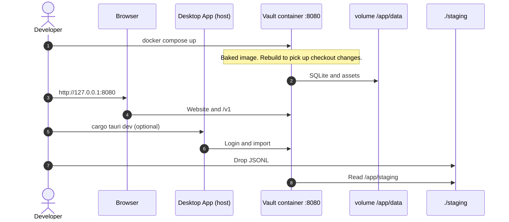

Day-to-day work from a clone usually runs the vault on the host — see [Contributing → Build and run](/vault/developer/contributing/#build-and-run). This page is Docker: a checkout that should look like a shipped install, or the published Hub image without compiling. If you only want to try the vault, start with [Try the vault](/vault/user/get-started/try-the-vault/).

## Prerequisites

- [Docker Desktop](https://www.docker.com/products/docker-desktop/) on Windows or macOS
- [Docker Engine](https://docs.docker.com/engine/install/) on Linux with the Compose v2 plugin

## Build a checkout image (Compose)

Run from the **repository root**. `docker/compose.release.yml` builds `docker/Dockerfile` from this tree (website baked in). After a code change, rebuild.

```bash title="Build the checkout image"
docker compose -f docker/compose.release.yml up --build
```

Copy [`.env.example`](https://github.com/bitrealm-io/message-vault/blob/main/.env.example) to `.env` — it sets `COMPOSE_FILE=docker/compose.release.yml`, so bare `docker compose up --build` from a clone uses that file. Override with `-f`.

Blank vault (no demo seed): `DEMO_DATA=false docker compose -f docker/compose.release.yml up --build`.

Serves the vault on port **8080**. Don't run this stack and the published-image Compose file at once; they share that port.



## Run the published image

The image `bitrealm/message-vault:latest` is the User Guide path. Start it without compiling anything:

```bash title="Run the published image"
docker run -d --name message-vault \
  -p 8080:8080 \
  -e DEMO_DATA=true \
  -v message-vault-data:/app/data \
  bitrealm/message-vault:latest
```

Or save [`docker/compose.yml`](https://github.com/bitrealm-io/message-vault/blob/main/docker/compose.yml) and run `docker compose up -d`. Save [`.env.example`](https://github.com/bitrealm-io/message-vault/blob/main/.env.example) next to it as `.env` — Compose reads `UID` and `GID` from it for the container user. Both commands seed sample data on first boot when `DEMO_DATA=true` and the volume is empty. Changing `DEMO_DATA` on an existing volume does not add or remove accounts.

The `message-vault-data` volume keeps the database between restarts. To make the sample account your own, create a second account as described on [Use your own messages](/vault/user/get-started/your-own-messages/). Upgrades are on [Update](/vault/user/how-to/update/).

## What is in the container

| Component | Purpose |
|---|---|
| Vault server | Website and `/v1/*` API on port **8080** |
| SQLite | Database for messages, contacts, and settings |
| FFmpeg | Media conversion for browser playback |
| Demo dataset | Sample conversations when `DEMO_DATA=true` and the volume is new |

The vault process runs inside the image. The desktop app stays on the host. For local development without Docker, use [Contributing](/vault/developer/contributing/#build-and-run).

## Related

- [Contributing](/vault/developer/contributing/#build-and-run)
- [Try the vault](/vault/user/get-started/try-the-vault/)
- [Update](/vault/user/how-to/update/)
- [HTTP API](/vault/developer/reference/api/)
- [Config and accounts](/vault/developer/reference/config-and-accounts/)
