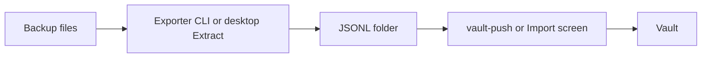
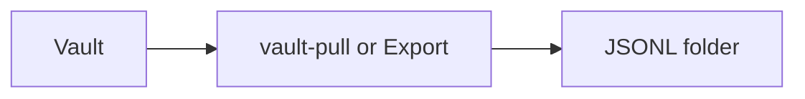

A phone backup is not the vault. An **exporter** reads the backup and writes a JSONL folder. **Import** loads that folder into a running vault (`vault-push` or the desktop Import screen). **Export** writes JSONL again (`vault-pull` or the desktop Export screen).

The tree and processes are on [Vault Design](/vault/developer/vault-design/). Field-by-field converter tables are on [Converter capabilities](/vault/developer/formats/). The full JSONL contract is [Export structure](/vault/developer/reference/export-structure/).

## Pipeline



The reverse path:



## JSONL basics

The vault imports JSON Lines at **schema version 3**. One `*.jsonl` file per conversation, plus media under `attachments/`:

1. **Line 1** — conversation header (`schema_version`, `export`, `conversation`)
2. **Following lines** — one message per line (`timestamp_unix_ms`, `direction`, `service`, `text`, `attachments`, and optional fields)

```jsonl title="One conversation file"
{"schema_version":3,"export":{"source":"sms-backup-restore","tool":"SMS Backup & Restore","owner_handle":"+15555550100","owner_display_name":"Me"},"conversation":{"chat_identifier":"+15555550101","conversation_type":"individual","participants":[{"handle":"+15555550101","display_name":"Sam"}]}}
{"guid":"msg-1","timestamp_unix_ms":1400773261000,"direction":"outgoing","service":"sms","text":"Hello"}
```

Flags, batching, and attachment uploads: [Export structure](/vault/developer/reference/export-structure/) and [`vault-push`](/vault/developer/reference/cli/vault-push/).

## Supported exporters

These are the backup sources to use when a full export is still possible.

| Source | Command | Mapping / input |
|--------|---------|-----------------|
| iMessage / iPhone backup | [`imessage-ir-exporter`](/vault/developer/reference/cli/imessage-ir-exporter/) | [CLI](/vault/developer/reference/cli/imessage-ir-exporter/) |
| SMS Backup & Restore | [`sms-backup-restore-exporter`](/vault/developer/reference/cli/sms-backup-restore-exporter/) | [Input](/vault/developer/formats/sms-backup-restore/input/) · [Mapping](/vault/developer/formats/sms-backup-restore/mapping/) |
| WhatsApp | [`whatsapp-exporter`](/vault/developer/reference/cli/whatsapp-exporter/) | [CLI](/vault/developer/reference/cli/whatsapp-exporter/) |

## Rescue / experimental

These sources are incomplete or reverse-engineered. Use them only when the file is the only copy left. Same idea as the User Guide [rescue imports](/vault/user/how-to/rescue-imports/) page.

| Source | Command | Mapping / input |
|--------|---------|-----------------|
| GO SMS Pro | [`go-sms-pro-exporter`](/vault/developer/reference/cli/go-sms-pro-exporter/) | [Mapping](/vault/developer/formats/go-sms-pro/mapping/) |
| iMazing | [`imazing-exporter`](/vault/developer/reference/cli/imazing-exporter/) | [Input](/vault/developer/formats/imazing/input/) · [Design](/vault/developer/formats/imazing/design/) |
| OpenExtract | [`openextract-exporter`](/vault/developer/reference/cli/openextract-exporter/) | [CLI](/vault/developer/reference/cli/openextract-exporter/) |
| SMS Backup+ | [`sms-backup-plus-exporter`](/vault/developer/reference/cli/sms-backup-plus-exporter/) | [Format](/vault/developer/formats/sms-backup-plus/format/) · [Mapping](/vault/developer/formats/sms-backup-plus/mapping/) |

## Vault JSONL tools

These commands move JSONL in and out of a running vault, or convert a folder that is already in a Message Vault export format. They are not backup parsers.

| Command | Job |
|---------|-----|
| [`vault-push`](/vault/developer/reference/cli/vault-push/) | JSONL folder → running vault |
| [`vault-pull`](/vault/developer/reference/cli/vault-pull/) | running vault → JSONL folder |
| [`message-reexporter`](/vault/developer/reference/cli/message-reexporter/) | convert an existing export directory ([convert](/vault/developer/formats/convert/)) |
