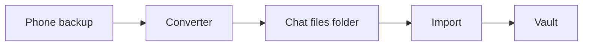
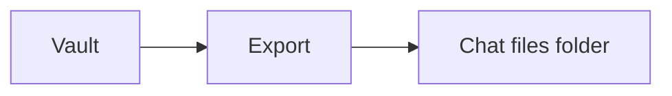

A phone backup is a copy of chats sitting on a computer. The vault is a separate program with its own database. The backup does not become vault data until a converter reads it and import loads the result.

[Vault Design](/vault/developer/vault-design/) shows the folders in this project and how the website talks to the vault. Which fields each converter fills in is on [Converter capabilities](/vault/developer/formats/). Every column in the chat files is on [Export structure](/vault/developer/reference/export-structure/).

## How chats get into the vault

1. A converter reads the backup. In the desktop app this is **Extract**. On the command line it is a converter program such as `whatsapp-exporter`.
2. The converter writes a folder of chat files, plus photos and other attachments in an `attachments/` folder.
3. Import loads that folder into a vault that is already running. In the desktop app this is the **Import** screen. On the command line this is the `vault-push` program.



## How chats come back out

Export copies chats from a running vault into a new folder of the same chat files. In the desktop app this is **Export**. On the command line this is the `vault-pull` program.



## Chat files

Each conversation is one text file whose name ends in `.jsonl`. JSON Lines means one JSON object per line.

1. The first line describes the conversation: who is in it, which backup it came from, and the current file layout (`schema_version` 3).
2. Each later line is one message: when it was sent, who sent it, the text, and any attachments.

Pictures and other media sit next to those files in `attachments/`.

```jsonl title="One conversation file"
{"schema_version":3,"export":{"source":"sms-backup-restore","tool":"SMS Backup & Restore","owner_handle":"+15555550100","owner_display_name":"Me"},"conversation":{"chat_identifier":"+15555550101","conversation_type":"individual","participants":[{"handle":"+15555550101","display_name":"Sam"}]}}
{"guid":"msg-1","timestamp_unix_ms":1400773261000,"direction":"outgoing","service":"sms","text":"Hello"}
```

The vault only reads this current layout (schema version 3). The full field list is on [Export structure](/vault/developer/reference/export-structure/). Options for `vault-push` (batch size, attachments, resume) are on the [`vault-push` command page](/vault/developer/reference/cli/vault-push/).

## Converters for full backups

Use these when a complete backup can still be made.

| Source | Command | More detail |
|--------|---------|-------------|
| iMessage or an iPhone backup | [`imessage-ir-exporter`](/vault/developer/reference/cli/imessage-ir-exporter/) | [Command page](/vault/developer/reference/cli/imessage-ir-exporter/) |
| SMS Backup & Restore | [`sms-backup-restore-exporter`](/vault/developer/reference/cli/sms-backup-restore-exporter/) | [Input files](/vault/developer/formats/sms-backup-restore/input/) · [Field mapping](/vault/developer/formats/sms-backup-restore/mapping/) |
| WhatsApp | [`whatsapp-exporter`](/vault/developer/reference/cli/whatsapp-exporter/) | [Command page](/vault/developer/reference/cli/whatsapp-exporter/) |

## Limited converters

Some files come from tools that were not built for this project, or that drop messages and attachments. These converters can still try. Prefer a full backup from Apple, SMS Backup & Restore, or WhatsApp when that is still possible. The User Guide calls these [rescue imports](/vault/user/how-to/rescue-imports/).

| Source | Command | More detail |
|--------|---------|-------------|
| GO SMS Pro | [`go-sms-pro-exporter`](/vault/developer/reference/cli/go-sms-pro-exporter/) | [Field mapping](/vault/developer/formats/go-sms-pro/mapping/) |
| iMazing | [`imazing-exporter`](/vault/developer/reference/cli/imazing-exporter/) | [Input files](/vault/developer/formats/imazing/input/) · [Design notes](/vault/developer/formats/imazing/design/) |
| OpenExtract | [`openextract-exporter`](/vault/developer/reference/cli/openextract-exporter/) | [Command page](/vault/developer/reference/cli/openextract-exporter/) |
| SMS Backup+ | [`sms-backup-plus-exporter`](/vault/developer/reference/cli/sms-backup-plus-exporter/) | [File layout](/vault/developer/formats/sms-backup-plus/format/) · [Field mapping](/vault/developer/formats/sms-backup-plus/mapping/) |

## Commands that talk to a running vault

These programs do not read a phone backup. They load or save the chat-file folder, or change a folder that is already in Message Vault's format.

| Command | What it does |
|---------|----------------|
| [`vault-push`](/vault/developer/reference/cli/vault-push/) | Loads a chat-file folder into a running vault |
| [`vault-pull`](/vault/developer/reference/cli/vault-pull/) | Writes a chat-file folder from a running vault |
| [`message-reexporter`](/vault/developer/reference/cli/message-reexporter/) | Turns an existing Message Vault export folder into another format, such as CSV or mail. See [Convert formats](/vault/developer/formats/convert/). |
