# Legacy Slint GUI screens

A visual record of `crates/message-vault-io-gui`, the original Slint desktop
app, captured before the crate is removed. The product replacement is the
Tauri desktop app (`src-tauri/` + `web/`).

These are HTML recreations built from the `.slint` sources on 2026-08-31 (app
version 0.6.0, default Graphite Blue dark theme), not screenshots of the
running app. The HTML sources live in [`legacy-slint-gui/html/`](legacy-slint-gui/html/)
if a render ever needs regenerating. Two liberties taken so every field is
visible: collapsible Advanced sections are drawn expanded (they default
closed), and combos show their default values.

The window had six reachable screens. Home fans out to the guided vault flow
(Credentials → Import or Export), Backup Account, and the advanced Extract
Messages form, whose fields reshape around the Backup type dropdown — one
capture per exporter below. Four more page files (`contacts`, `format`,
`vault`, `log`) were already unreachable from the window, marked "legacy
screens kept for reference" in `app-window.slint`; the Log panel survives as
the second tab of the Credentials, Import, and Vault Export screens.

## Home

`ui/pages/home.slint` — the four workflow cards plus the theme and color
preset pickers.

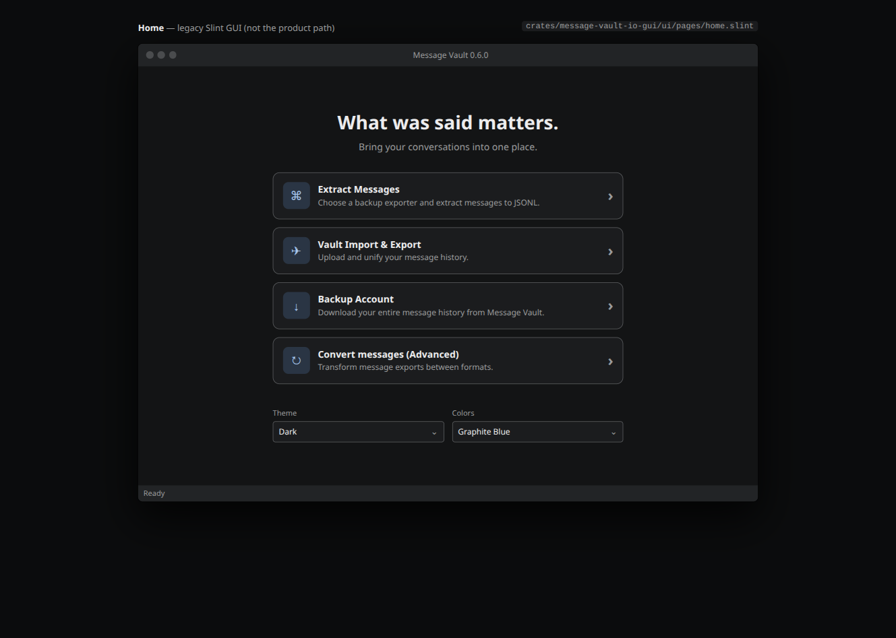

## Vault Credentials

`ui/pages/credentials.slint` — first step of the guided vault flow: URL, API
token, and whether to continue into Import or Export.

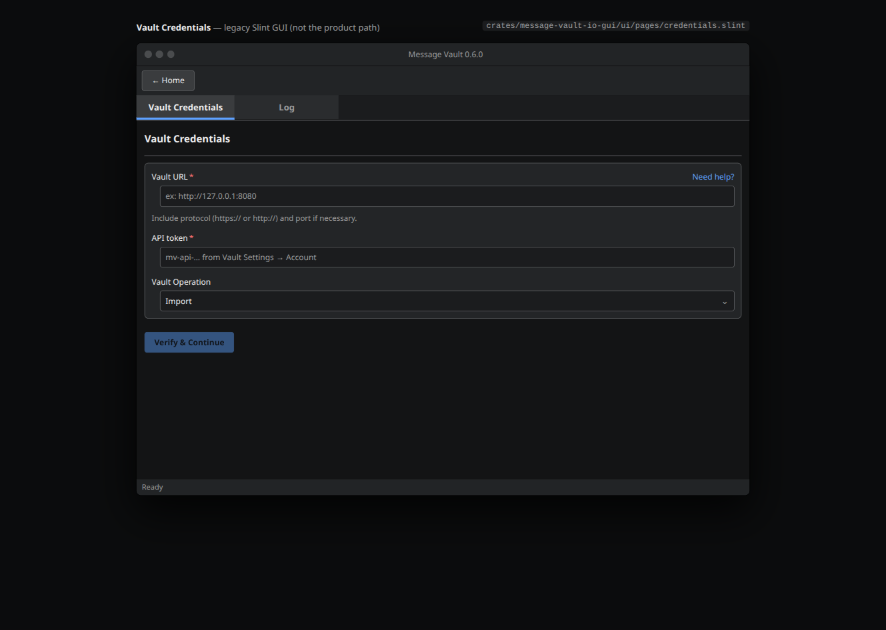

## Import Messages (guided)

`ui/pages/import.slint` — iMessage-only guided import (iOS backup, macOS
chat.db, or an existing JSONL archive), with attachment conversion, message
filtering, and processing options.

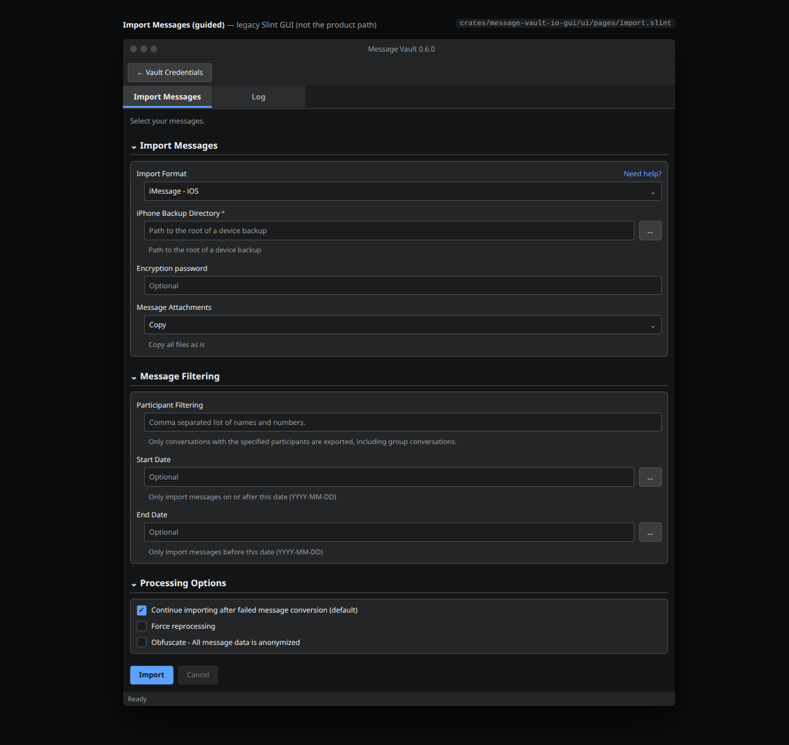

## Vault Export (guided)

`ui/pages/vault-export.slint` — pulls messages back out of a vault with
Fastmail-style search operators and a query-before-export count.

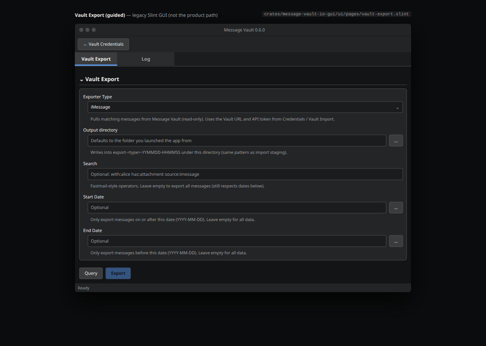

## Backup Account

`ui/pages/backup-account.slint` — full-history download to a local directory.

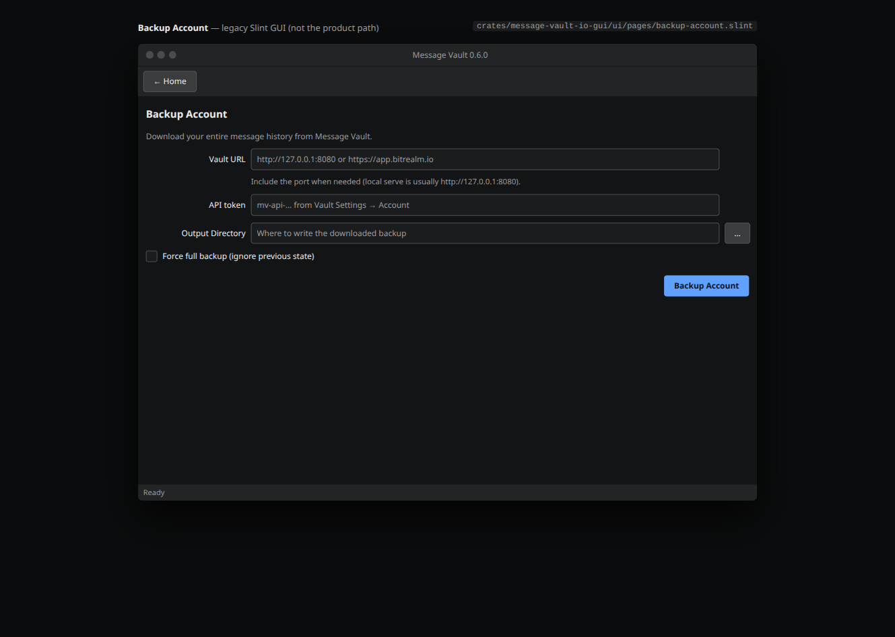

## Extract Messages, per exporter

`ui/pages/extract.slint` — one form, seven shapes. The visibility flags come
from `src/sync.rs` (`extract_visibility_flags`): iMessage and WhatsApp get
their own sections, GO SMS Pro / SMS Backup & Restore / SMS Backup+ require
owner phone numbers, everything except iMessage and WhatsApp offers a
contacts file, and SMS Backup+ alone takes backup emails, a name-mapping CSV,
and an "Input file or folder" label. Every variant shares the attachment
handling combo and the message-filtering tail.

### iPhone backup

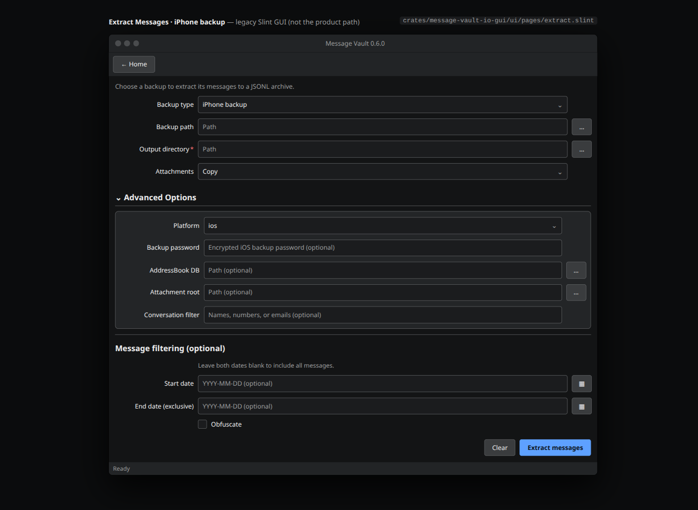

### SMS Backup & Restore

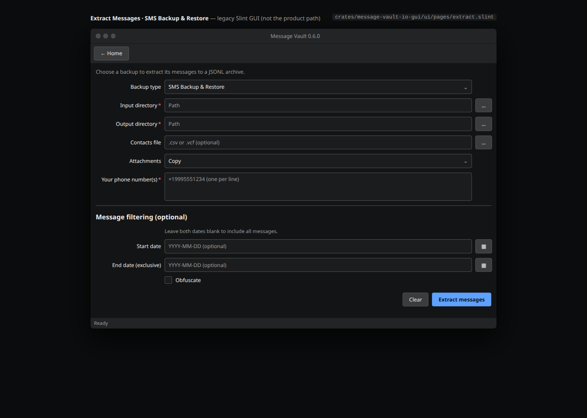

### WhatsApp (Android shown; iOS swaps the contacts field to ContactsV2.sqlite and drops the decryption key)

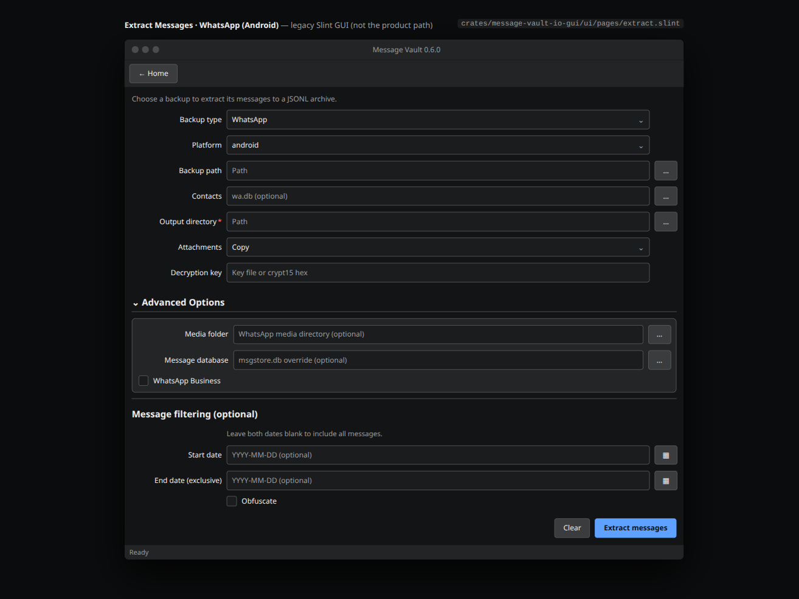

### GO SMS Pro (experimental)

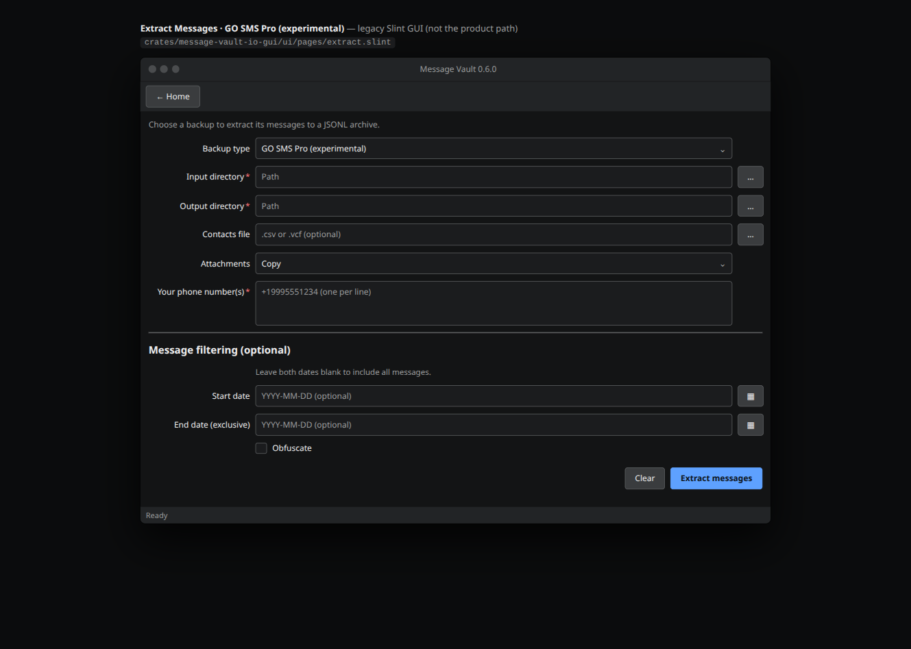

### iMazing (experimental)

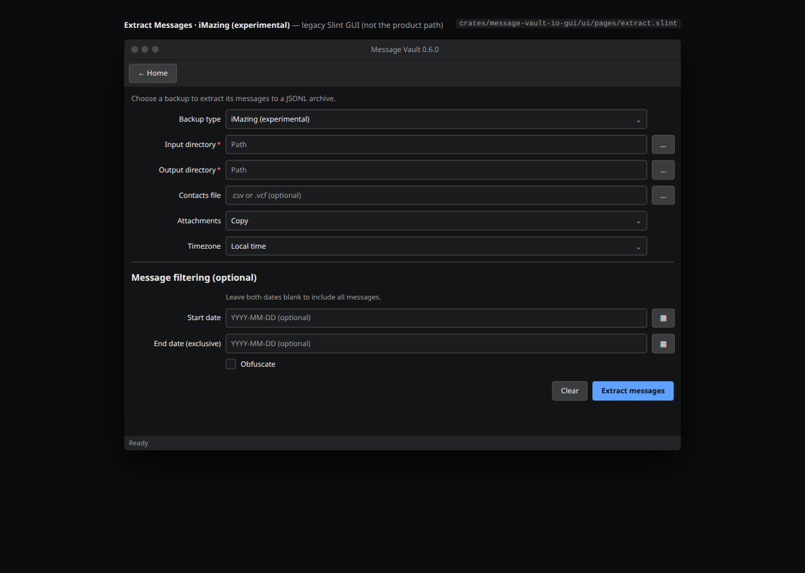

### OpenExtract (experimental)

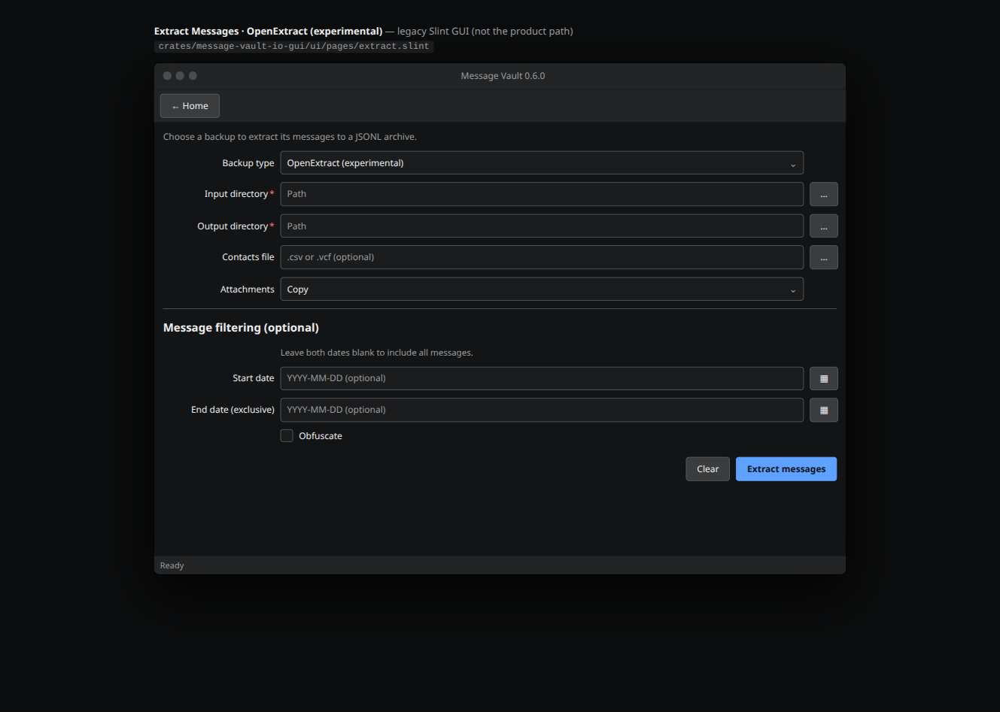

### SMS Backup+ (experimental)

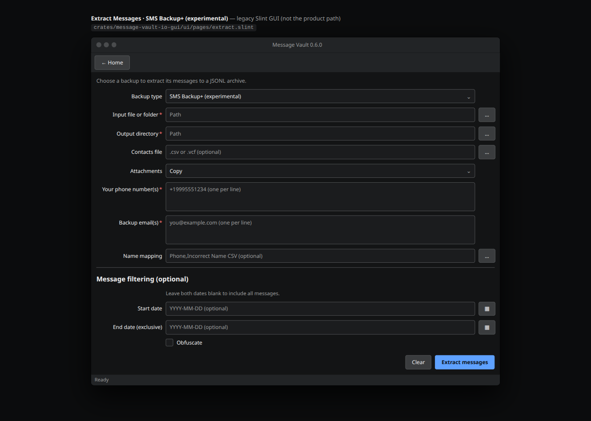
