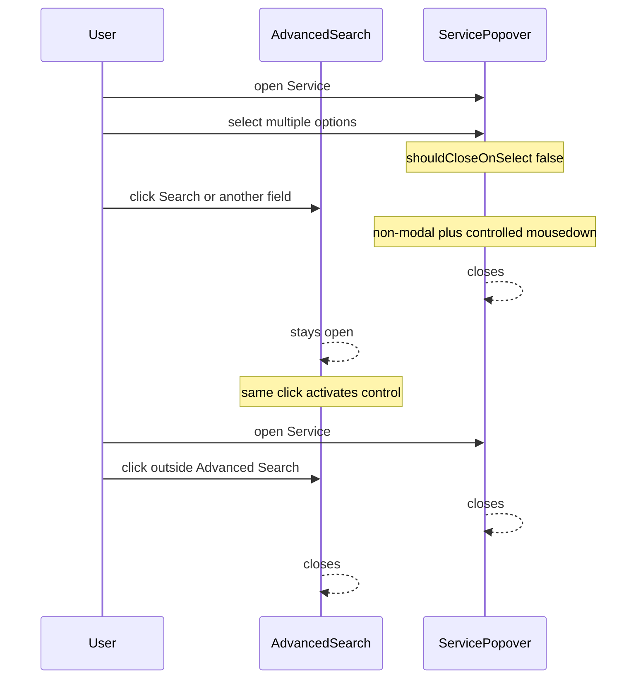

# Advanced search: Service menu dismisses panel

**Date:** 2026-08-10  
**Status:** Implemented  
**Scope:** Contacts Advanced Search outside-click dismiss vs React Aria Select/Popover (Service multi-select)

## Problem

With Advanced Search open on contacts, opening the **Service** multi-select and then clicking back on the Advanced Search panel (to press **Search** or edit another field) either:

1. Closed the entire Advanced Search form (modal underlay path), or
2. Left the Service list open (plain `isNonModal` path).

Selecting options inside the Service menu worked. The failure was “click the form again while the menu is open.”

## Cause

Contact search dismisses Advanced Search on `mousedown` outside `rootRef`, while ignoring portaled overlays (`data-mv-overlay`, listbox/option/dialog).

React Aria’s Select `Popover` is modal by default and places a **transparent underlay** over the page (including over Advanced Search). That underlay lives outside `rootRef`. Ignoring underlay clicks kept Advanced Search open but blocked click-through to Search and other fields. Setting only `isNonModal` removed the underlay and also disabled React Aria’s outside-click dismiss (`isDismissable: !isNonModal`), so the Service list stayed open.

## Goals

- Clicking Advanced Search while the Service menu is open keeps Advanced Search open, dismisses the Service list, and activates the clicked control in the same click.
- Clicking truly outside Advanced Search still closes the panel.
- Service multi-select still allows picking multiple services without the menu closing on each selection (`shouldCloseOnSelect={false}`).

## Non-goals

- Redesigning Advanced Search layout or Service UX beyond dismiss behavior.
- Changing shared Activity / DateField popovers (they stay modal; underlay ignore in `isPortaledOverlayTarget` still applies where used).

## Approach

**Primary:** Make only the Service multi-select a controlled, non-modal popover with an explicit document `mousedown` listener that closes the list without stopping the event. That restores one-click click-through to form controls and avoids the modal underlay race with Advanced Search dismiss.

**Not used alone:** Modal underlay + underlay ignore (blocks first click). Plain `isNonModal` without a controlled outside-click listener (list never closes).

## Design

### Service multi-select

In `ServiceMultiSelect` (`AdvancedSearchForm.tsx`):

- Controlled `isOpen` / `onOpenChange` on `RACSelect`.
- Service `Popover` sets `isNonModal` (no underlay).
- Refs on the select root and popover; while open, a document `mousedown` listener closes the list when the target is outside both. The listener does not call `stopPropagation` or `preventDefault`, so the same click can focus another field, press Search, or dismiss Advanced Search.
- Keep `shouldCloseOnSelect={false}`, `data-mv-overlay`, Escape / keyboard via React Aria `onOpenChange`.

### Shared Select / DateField

Leave modal. No change required for this bug.

### Outside-click helper

`isPortaledOverlayTarget` treats only `[data-mv-overlay]` and `[data-testid='underlay']` as overlay targets. Broad `[role='listbox']` / `[role='option']` matching is not used, because contact and conversation lists also use those roles and would prevent dismissing the search popdown when clicking a row.

### Expected interaction

## Testing

- Manual: open Advanced Search → open Service → select multiple services → click **Search** or Name/Handle once → panel stays open; Service menu closes; control activates.
- Manual: open Service → click outside the list column / Advanced Search → panel closes.
- Manual: Escape closes only the Service list.
- Manual: Activity and date pickers: click back on form does not close Advanced Search (existing modal + overlay helper path).

## Follow-ups

- None required for this bug. If Activity/Date need the same one-click click-through, apply the same controlled non-modal pattern selectively.
