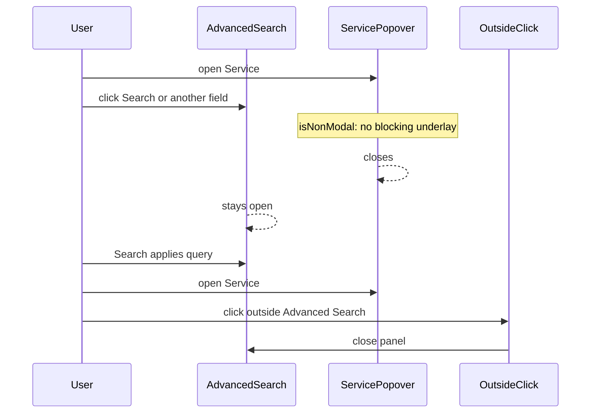

# Advanced search: Service menu dismisses panel

**Date:** 2026-08-10  
**Status:** Approved for planning  
**Scope:** Contacts Advanced Search outside-click dismiss vs React Aria Select/Popover (Service multi-select and sibling menus)

## Problem

With Advanced Search open on contacts, opening the **Service** multi-select and then clicking back on the Advanced Search panel (to press **Search** or edit another field) closes the entire Advanced Search form.

Selecting options inside the Service menu works. The failure is “click the form again while the menu is open.”

## Cause

Contact search dismisses Advanced Search on `mousedown` outside `rootRef`, while ignoring portaled overlays (`data-mv-overlay`, listbox/option/dialog).

React Aria’s Select `Popover` is modal by default and places a **transparent underlay** over the page (including over Advanced Search). That underlay lives outside `rootRef` and is not matched by the current overlay selector. The click is treated as “outside,” so Advanced Search closes before the user can use **Search** or other fields.

## Goals

- Clicking Advanced Search while a filter menu is open keeps Advanced Search open and dismisses only the menu (so **Search** / other fields remain usable).
- Clicking truly outside Advanced Search still closes the panel.
- Service multi-select still allows picking multiple services without the menu closing on each selection (`shouldCloseOnSelect={false}`).

## Non-goals

- Redesigning Advanced Search layout or Service UX beyond dismiss behavior.
- Changing conversation-list advanced search layout (shared Select/DateField popovers may get the same `isNonModal` fix as a side effect).

## Approach

**Primary:** Mark filter popovers as non-modal (`isNonModal`) so React Aria does not install a blocking underlay over the form.

**Secondary:** Extend `isPortaledOverlayTarget` so any remaining React Aria top-layer / underlay nodes are treated like overlays and do not dismiss Advanced Search.

## Design

### Popovers

Set `isNonModal` on:

- Service multi-select `Popover` in `AdvancedSearchForm`
- Shared `Select` `Popover` in `Select.tsx` (Activity and other compact selects)
- Shared `DateField` calendar `Popover` in `DateField.tsx`

Keep existing `data-mv-overlay` on those popovers.

### Outside-click helper

In `web/src/lib/portaledOverlay.ts`, treat as overlay targets:

- Existing: `[data-mv-overlay]`, `[role='listbox']`, `[role='option']`, `[role='dialog']`
- Added: React Aria top-layer / underlay selectors used by the installed `react-aria-components` version (confirm in DOM while a Select is open; e.g. `[data-react-aria-top-layer]` and/or underlay/modal-overlay class names present in this app)

`ContactSearch` and `ListColumn` keep using `isPortaledOverlayTarget` unchanged at the call site.

### Expected interaction

## Testing

- Manual: open Advanced Search → open Service → click **Search** or Name/Handle → panel stays open; Service menu closes; Search works.
- Manual: open Service → click outside the list column / Advanced Search → panel closes.
- Manual: Activity and date pickers: same “click back on form” does not close Advanced Search.
- Unit (optional): `isPortaledOverlayTarget` returns true for a fixture element matching the underlay/top-layer selector.

## Follow-ups

- None required for this bug. If single-select menus should stay modal for a11y elsewhere, split a `isNonModal` prop on shared `Select` instead of always-on.
