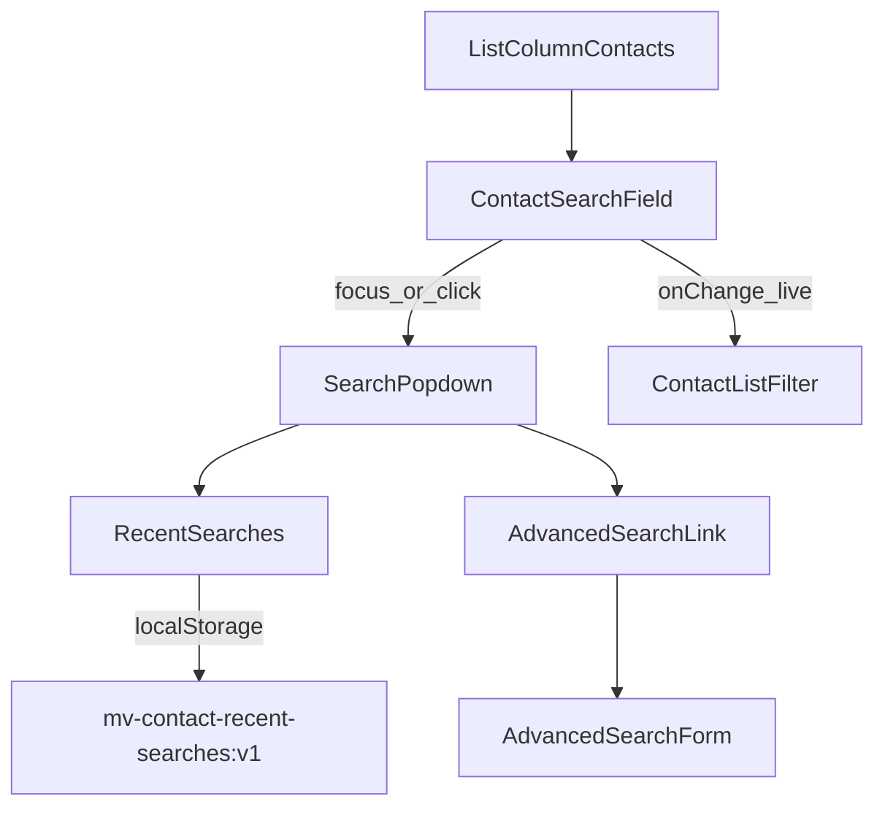

# Contacts column search popdown

**Date:** 2026-08-10  
**Status:** Approved for planning  
**Scope:** Contacts list column search UI in the Vite/Tauri web app (`web/`)

## Problem

The contacts column uses a plain filter field plus a separate **Advanced filters** link under the search bar. That is unlike common mail/client search UIs and hides recent queries. Users should get a Fastmail-style search field: magnifying glass, clear placeholder, popdown on focus with recent searches and advanced search at the bottom, while typing still filters contact display names and handles.

## Goals

- Placeholder text: **Search contacts**.
- Magnifying glass icon on the left of the search field.
- No **Advanced filters** button under the field for contacts.
- Focus/click on the search field opens a popdown menu.
- Typing continues to live-filter contacts by display name and handles.
- Recent searches are persisted and shown in the popdown (with Clear all).
- Advanced search is an item at the bottom of the popdown (reuses the existing contacts advanced form).
- No “Narrow your search” chip row in v1 (progressive query builder deferred; contact filter space is small).

## Non-goals

- Changing conversation-column search (keeps current `GlobalSearch` + advanced toggle).
- Progressive multi-step query builder / “Narrow your search” chips.
- Server-side contact search API changes.
- Syncing recent searches across devices or accounts.

## Architecture

When `ListColumn` is in contacts mode (`searchMode === "contacts"`), it renders the new contacts search control instead of `GlobalSearch` plus the advanced toggle. Conversations mode is unchanged.

## Interaction

### Search field

- Left: magnifying-glass icon (decorative).
- Placeholder: `Search contacts`.
- Right: clear (×) when the value is non-empty; clearing empties the field and resets the list filter.
- Focus or click opens the popdown.
- Escape closes the popdown (when open) without clearing the query.
- Click outside closes the popdown.
- Typing updates the contact list live through the existing `cq` / `onSearchChange` path (client filter on name + handles).
- Enter applies/submits the current query and saves it to recent searches (if non-empty), then closes the popdown.

### Popdown layout

1. **Recent searches** — header with **Clear all** on the right; each row is a clock icon + query string. Omit this section entirely until at least one query has been saved.
2. Divider (only when the recent section is visible).
3. **Advanced search** — settings/sliders icon + label; opens the existing contacts `AdvancedSearchForm`. When there are no recents, Advanced search is still shown as the sole popdown body (no empty recent header).

Choosing a recent row fills the input, applies the filter, bumps that query to the top of recent, and closes the popdown.

### Advanced search

- Opened from the popdown item (not from a permanent under-field link).
- Contacts fields: name, handle, no-name, first/last message date bounds, activity, service.
- **First message** / **Last message** each use an operator Select (**Any**, **On or after**, **Before**, **Between**) plus date field(s):
  - Any → no date field; no tokens.
  - On or after / Before → one date under the Select.
  - Between → two dates in a row under the Select (start then end).
- Date semantics (calendar day on MIN/MAX message timestamp):
  - **On or after** → `>=` that day.
  - **Before** → strictly `<` that day.
  - **Between** → half-open: `>= start` and `< end` (same operators composed).
- Default operator: **Any**.
- Query tokens (new UI always emits prefixes; bare dates remain back-compat on the server):
  - `first-contact:>=YYYY-MM-DD`, `first-contact:<YYYY-MM-DD` (and same for `last-contact:`).
  - Between emits both tokens. Bare `first-contact:DATE` = on or after; bare `last-contact:DATE` = on or before.
- **Search** sets the composed query on the field, runs the filter, saves to recent, closes the form and popdown.
- **Cancel** / close dismisses the form without changing recent.

## Data: recent searches

| Concern | Decision |
|--------|----------|
| Storage | `localStorage` key `mv-contact-recent-searches:v1` |
| Shape | JSON array of strings, newest first |
| Cap | 10 entries |
| Dedup | Saving an existing query moves it to index 0; no duplicate strings |
| When to save | Enter; selecting a recent row (reorder); Advanced **Apply** |
| When not to save | Every keystroke; empty/whitespace-only queries |
| Failures | Quota / private mode / corrupt JSON → treat as empty list; search still works |

Small helper module (read / write / clear / push) owns parsing and the versioned key.

## Components (expected files)

- New contacts search UI component(s) under `web/src/components/` (field + popdown).
- Recent-searches helper under `web/src/lib/`.
- `ListColumn.tsx`: branch on `searchMode === "contacts"` to use the new control; remove contacts advanced toggle; keep conversations path as today.
- Reuse `AdvancedSearchForm` with `mode="contacts"`.

## Errors and edge cases

- localStorage unavailable or corrupt: empty recent list; no thrown errors in the UI.
- Empty Enter: clear/apply empty filter; do not write recent.
- Popdown stacking: panel anchors under the search field in the list column (same idea as the current absolute advanced panel); list column may raise `z-index` while open.
- Contact drawer and column resize continue to work; Escape prefers closing the popdown when it is open.

## Verification

- Contacts: placeholder and magnifying glass visible.
- Focus opens popdown; typing filters the list without requiring Enter.
- Enter with a non-empty query adds/bumps recent; Clear all empties recent.
- Selecting a recent applies that query and closes the popdown.
- Advanced search Apply fills the field, filters, saves recent, closes UI.
- Conversations column still shows its existing search + advanced control.

## Follow-ups (out of scope)

- Optional static “Narrow your search” chips later.
- Same popdown pattern for conversations.
- Account-scoped or server-synced recent searches.
