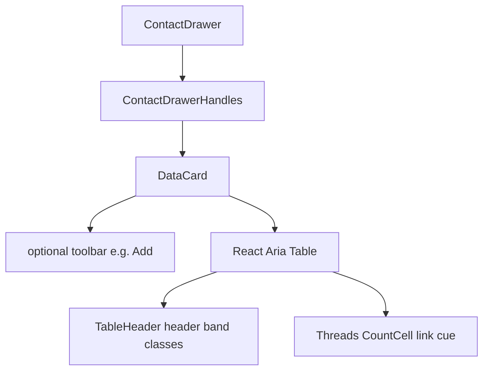

# Contact handles DataCard contrast

**Date:** 2026-08-11  
**Status:** Approved for planning  
**Scope:** Contact drawer handles table styling in the Vite/Tauri web app (`web/`)

## Problem

The contact info drawer’s Service / Identity table sits on a bland elevated card. Column headers use muted text on a similar surface, so they do not stand out. Body text and the card background wash into each other. The Threads count is an accent-colored number without a clear link cue, so it is hard to tell you can open conversations from that cell.

## Goals

- Make the handles table readable: clearer card surface, stronger headers, body text that does not disappear into the background.
- Make clickable Threads counts obviously interactive (accent + always-on underline + small open cue).
- Introduce a small reusable **DataCard** shell so this look can be reused later (e.g. Settings tables) without forcing a migration now.
- Keep existing behavior: sort, Add/Edit/Unlink, browse-on-Threads when wired, max card width.

## Non-goals

- New CSS theme tokens beyond the existing variables (`panel`, `elevated`, `text`, `muted`, `accent`, soft mixes).
- Migrating Settings / Storage tables in this change (follow-up only).
- Making Direct Messages or Group Messages counts into links.
- Changing drawer layout, docked vs overlay, or API fields.

## Decisions

| Topic | Choice |
|--------|--------|
| Contrast level | Medium: card on `bg-panel`, distinct header band, stronger header labels |
| Threads affordance | Accent number, always-on underline, small chevron (or equivalent) when clickable |
| Architecture | Shared DataCard primitive; first consumer is handles table only |
| Settings adoption | Documented follow-up; not required for this pass |

## Approach

Token-and-shell restyle via a **DataCard** component. Do not replace React Aria `Table`. The card is a visual wrapper (border, surface, toolbar slot, optional scroll). Header-band and cell class helpers live next to DataCard so callers share the same contrast rules.

## Architecture

## Components

### `DataCard` (`web/src/components/DataCard.tsx`)

- **Props:** `children`, optional `toolbar` (React node), optional `className`, optional max-width class (default `max-w-4xl`).
- **Structure:** bordered rounded card → optional top toolbar row (right-aligned actions) → optional horizontal scroll region → `children`.
- **Surfaces:** outer card `bg-panel` + `border-border` + `rounded-lg` + padding. Distinct from the drawer panel behind it.
- Does not own table markup.

### Shared table chrome (same module or tiny sibling)

- Class strings for:
  - Header row / header cells: header band background (`bg-elevated` or soft accent mix if elevated is still too flat on some themes), labels `text-text`, keep uppercase micro-label style and semibold weight.
  - Body cells: primary `text-text`; use `text-muted` only for secondary values (dates, em dash placeholders).
- Sortable header caret behavior stays as today (caret to the right of the label); only colors/contrast change.

### `ContactDrawerHandles`

- Replace the current ad-hoc elevated wrapper with `<DataCard toolbar={Add button}>…</DataCard>`.
- Apply header-band classes on `TableHeader` / sortable columns.
- **`CountCell` when `onClick` is set and value > 0:**
  - Accent-colored number
  - Always-on underline
  - Small chevron (or similar) after the number
  - Accessible name such as “Open N threads”
  - Hover may deepen underline or opacity; focus ring remains visible
- When not clickable (value 0 or no handler): plain number (`text-muted` for zero is fine).
- Total row Threads stays non-link (same as today).

## Visual rules (medium contrast)

1. Card body quieter than today’s full-card elevated wash (`bg-panel`).
2. Header band clearly different from body (`bg-elevated` or soft accent wash).
3. Header labels use `text-text`, not `text-muted`.
4. Body primary values use `text-text`.
5. Clickable Threads must read as a control without relying on hover alone.

## Error handling

No new failure modes. Browse and mutations keep existing error behavior.

## Verification

- Dark and light themes: header band readable; body not washed out; card distinct from drawer background.
- Threads > 0 with browse wired: accent, underline, chevron; keyboard focus; click opens conversations.
- Threads 0 or no browse: not styled as a link.
- Sort headers still work; caret still beside label.
- Add / edit / unlink behavior unchanged.
- Long identities still wrap/break; card keeps horizontal scroll when needed.

## Follow-ups (out of scope)

- Adopt DataCard for Settings storage / import tables.
- Optional: link Total Threads if product wants aggregate browse later.
