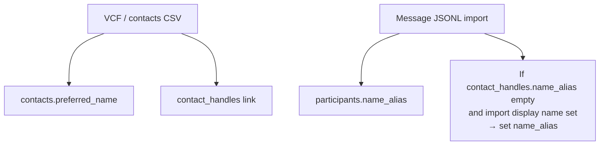

# Name aliases (preferred name vs per-identity alias)

**Date:** 2026-08-11  
**Status:** Approved for planning  
**Scope:** Display toggle, import seeding of aliases, rename `name_hint` → `name_alias`, Contact Identity Alias column (view-only)

## Problem

One contact has a single **preferred name** (often from an address book). The same person can appear under different display names on different services (WhatsApp “Matt” vs iMessage/Contacts “Matthew”). Today the UI leans on preferred name when linked, so multi-service imports feel flattened. Some users want that consistency; others want each service’s name.

## Goals

- Keep **one preferred name** per contact for the Contacts list and contact header.
- Store a **name alias** per **service + identity** (`contact_handles`).
- Appearance toggle **Use name aliases** (above Theme, default **off**): when on, person labels use alias → preferred → identity.
- Seed aliases from message imports with **first wins** (fill empty only).
- Rename every `name_hint` field/column/API key to **`name_alias`**.
- Show a read-only **Alias** column on the Contact Identity card.

## Non-goals

- Editing aliases in the UI (follow-up; hand edit can land later).
- Conflict UI when imports disagree on an alias.
- Last-import-wins for aliases.
- Backward-compatible dual-read of `name_hint` (no dual column, no API alias).

## Decisions

| Topic | Choice |
|--------|--------|
| Preferred name source | Address book / VCF / contacts CSV / manual rename |
| Alias storage | `contact_handles.name_alias` (service + identity) |
| Thread import residue | `participants.name_alias` (and staging equivalent) — renamed from `name_hint` |
| Toggle location | Settings → Appearance, above Theme |
| Toggle default | Off |
| Display when on | alias → preferred name → raw identity |
| Contacts list / contact header | Always preferred name |
| Import conflict on alias | First wins: set only if empty |
| Rename | All `name_hint` → `name_alias` |
| Existing DBs | No compatibility; update DDL and wipe/recreate local vaults |

## Behavior

### Toggle off (default)

Same as today for linked people: preferred name drives labels in threads list, messages, and similar.

### Toggle on

For a labeled person tied to a handle:

1. If that handle’s contact link has a non-empty `name_alias`, show it.
2. Else if the contact has a preferred name, show it.
3. Else show the raw identity.

Contacts list rows and the contact drawer title stay on preferred name so the address book identity does not flicker per service.

### Contact Identity card

Add a read-only **Alias** column (empty → em dash). No edit control in v1.

## Import rules

- **VCF / contacts CSV:** preferred name + handle links only. Does not write aliases.
- **Message import:** writes participant `name_alias` from IR display names. When linking to a contact handle, if `contact_handles.name_alias` is empty and the import display name is non-empty, set it. Never overwrite a non-empty alias.
- Re-importing the same identity with a different display name leaves the existing alias alone (first wins). Users who dislike the first preferred name correct it via VCF or rename; alias hand-edit is a later UI.

## Rename: `name_hint` → `name_alias`

Breaking rename everywhere the old name appears, including:

- `schema/sql/contacts.sql` (`contact_handles`)
- `schema/sql/messages.sql` / `staging.sql` (`participants` / staging participants)
- Vault server, web app, web-next, IR/demo-seed/exporters as applicable
- Public docs (`database.md`, etc.)
- Generated schema fixtures

**No backward compatibility:** do not keep reading `name_hint`. Fresh DDL; operators wipe or recreate vault data. No `ALTER TABLE RENAME COLUMN` requirement for product support (local demos wipe `data/`).

## Appearance preference

Persist the toggle with other appearance settings (same storage style as theme). Label roughly: **Use name aliases** with a short muted explanation that each service+identity can show its imported name when enabled.

## Out of scope / follow-ups

- Inline edit of Alias on Contact Identity.
- Per-contact override of the global toggle.
- Deriving alias at read time from participants without storing on `contact_handles`.

## Testing

- Import VCF then WhatsApp+iMessage for the same phone on two platforms: preferred name from VCF; two aliases first-filled from each service’s display name.
- Second import with a different display name for the same service+identity does not change the alias.
- Toggle off → preferred in thread labels; toggle on → aliases where set.
- Contacts list title unchanged when toggle flips.
- Grep: no remaining `name_hint` in schema/server/web (except historical plan docs if left alone).
