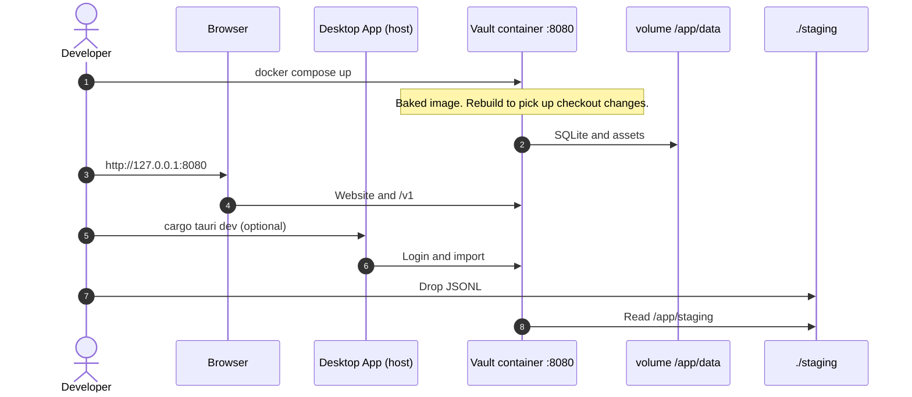

# Move maintainer architecture into Astro docs

**Date:** 2026-08-22  
**Status:** Approved for planning

## Context

Architecture notes still live under `docs/maintainers/`. The published Developer guidebook already has **Vault Design** (directory map, C4 SVGs, four host-process Mermaid sequences) and **Message Transfer**. Readers still have to open GitHub for the shared `ConversationDocument` schema (`architecture/message-ir.md`) and for PlantUML sources.

`sequence_diagram.md` is a duplicate of the four sequences already on Vault Design. `diagrams.txt` describes a bind-mount Docker loop this repo no longer runs (source mounted at `/app`, cargo `target` cache, SQLite browser container on 8081). Current Compose is a baked image on port 8080 with a data volume and optional `staging` mount.

The VS Code PlantUML settings still point at `docs/maintainers/architecture/puml`. C4 SVGs exist twice: `puml/img/` and `docs/src/assets/vault-design/`.

`astro-plantuml` 0.2.0 on GitHub supports Astro 7. npm still publishes 0.1.4 (Astro 5 only). This work does not add that package.

## Goal

Every remaining maintainer architecture page is on the Developer site. `docs/maintainers/` is gone. PlantUML sources and published SVGs share one folder. Operator Docker shows a Compose diagram that matches `docker/compose.yml` and `docker/compose.release.yml`.

## Non-goals

- Installing `astro-plantuml` (wait until 0.2.0 is on npm)
- Changing Compose, the Dockerfile, or how the vault runs in Docker
- Adding a code-signing page (`signing.md` is already missing)
- Moving `crates/message-vault-io-gui/gui.md`
- Deleting or merging the leftover Starlight copies that sit next to the live `vault/` pages (see Leftover copies)
- Rewriting Common message beyond Starlight front matter, fixed links, and the new URL

## Decisions

1. **Delete `docs/maintainers/`.** No stub. No README pointer. Architecture is the Developer site plus `docs/src/assets/architecture/`.
2. **Developer sidebar group Architecture** after Contributing: Vault Design, Message Transfer, Common message. Then Run from source, Operator Docker, and the rest stay as they are.
3. **Keep published URLs** for Vault Design (`/vault/developer/vault-design/`) and Message Transfer (`/vault/developer/message-transfer/`). Do not move those markdown files into an `architecture/` folder.
4. **Common message** is a new Starlight page at `/vault/developer/architecture/common-message/`, content from `docs/maintainers/architecture/message-ir.md`. Add title and description front matter. Replace relative links with Starlight paths (`/vault/developer/reference/export-structure/`) and GitHub crate links.
5. **Delete `sequence_diagram.md`.** Edit sequences on Vault Design. Remove the “copy Mermaid from maintainers” sentence.
6. **PlantUML lives under `docs/src/assets/architecture/`.** Move the three `.puml` files and their SVGs there. Point Vault Design images at those SVGs. Delete `docs/src/assets/vault-design/` and the `puml/img/` copies. Docs build does not run PlantUML. Edit `.puml`, export SVG into the same folder, commit both.
7. **VS Code PlantUML** in `.vscode/settings.json`: `plantuml.diagramsRoot` and `plantuml.exportOutDir` are both `docs/src/assets/architecture`.
8. **Compose diagram on Operator Docker**, not Vault Design. Replace `diagrams.txt`. Do not copy the old sequence. Match Compose: host browser and optional Tauri/Vite; one vault container on **8080**; named volume → `/app/data`; optional `./staging` → `/app/staging`. No 8081, no source mount, no `/app/target`, no Cargo registry, no “restart to recompile.” Checkout path rebuilds the image after code changes. Published path pulls `bitrealm/message-vault`. Same runtime picture.
9. **Retarget live links.** Format pages, Vault Design, Contributing, Developer index, `README.md`, crate READMEs (`crates/libs/ir`, `crates/libs/ir-format`), and the `.cursorrules` directory map. Historical files under `docs/superpowers/` may keep old paths.
10. **Leftover copies.** Markdown under `docs/src/content/docs/` *without* `vault/` in the path (for example `docs/src/content/docs/formats/`) is an older copy from before the `/vault/` URL split. It is not in the sidebar, so it is not a published page. Those files still exist and still link at GitHub `docs/maintainers/architecture/message-ir.md`. Change those links to `/vault/developer/architecture/common-message/` so they do not point at a deleted file. Do not delete that leftover tree or add it to the sidebar.

## What changes

| Path | Change |
|------|--------|
| `docs/astro.config.mjs` | Architecture group: vault-design, message-transfer, architecture/common-message |
| `docs/src/content/docs/vault/developer/architecture/common-message.md` | New page from `message-ir.md` |
| `docs/src/content/docs/vault/developer/vault-design.md` | Common message URL; C4 images from `assets/architecture/`; drop maintainer source notes |
| `docs/src/content/docs/vault/developer/message-transfer.md` | Link Common message if a GitHub `message-ir` citation appears |
| `docs/src/content/docs/vault/developer/docker-compose.md` | Add Compose Mermaid (sketch below) |
| `docs/src/content/docs/vault/developer/index.md` | List Architecture pages; drop any `docs/maintainers` pointer |
| `docs/src/content/docs/vault/developer/contributing.md` | Point schema notes at Common message, not `docs/maintainers/` |
| `docs/src/content/docs/vault/developer/formats/*.md` | Shared-model links → `/vault/developer/architecture/common-message/` |
| Leftover `docs/src/content/docs/formats/*.md` (no `vault/`) | Same link change only |
| `docs/src/assets/architecture/` | `.puml` + SVG for the three C4 diagrams |
| `docs/src/assets/vault-design/` | Delete after images move |
| `.vscode/settings.json` | PlantUML root and export dir as above |
| `README.md` | Remove “docs/maintainers — not yet ported”; point at Developer Architecture |
| `.cursorrules` | Directory map: drop `docs/maintainers/`; note C4 sources under `docs/src/assets/architecture/` |
| `crates/libs/ir/README.md`, `crates/libs/ir-format/README.md` | Shared model → published Common message URL |
| `docs/maintainers/` | Delete the directory |

## Operator Docker — Compose sequence sketch

Place after **What is in the container**. Short intro: the vault process is the image; the desktop app stays on the host.

Do not add a SQLite-browser participant. `--sqlweb` is host-only on `./scripts/run-vault-dev.sh`.

## Voice

Match Vault Design and Operator Docker: short sentences, no “we” / “us” / “our”. Starlight asides are optional. Do not use GitHub `> [!TIP]` alerts.

## Verification

- `docs/maintainers/` does not exist
- `rg docs/maintainers` is empty in live trees (`docs/src/content/docs/`, `README.md`, `.cursorrules`, `crates/libs/ir/README.md`, `crates/libs/ir-format/README.md`, `.vscode/settings.json`)
- Developer sidebar shows Architecture with three pages; Common message renders
- Vault Design C4 images load from `docs/src/assets/architecture/`
- Operator Docker Mermaid has no 8081, bind-mount `/app`, or `target` cache
- `cd docs && npm run check && npm run build` succeeds

## Success criteria

- A contributor reads architecture on bitrealm.io without opening `docs/maintainers/`
- Editing a C4 diagram is: change the `.puml` next to the SVG, export, commit both
- Compose documentation matches the Compose files in `docker/`
